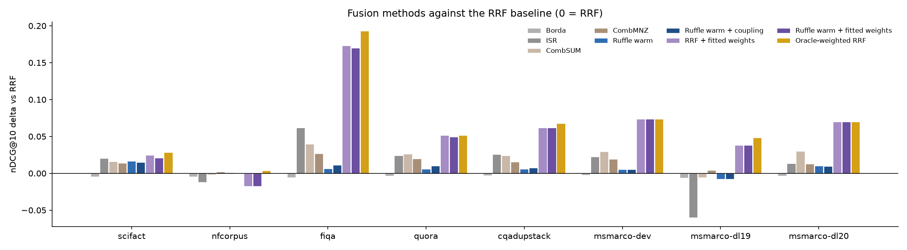

# Benchmark summary

Ruffle fuses ranked lists from several retrieval channels and adaptively
reweights them per query, without relevance labels and without score
calibration. This page compares it on standard BEIR collections against plain
reciprocal-rank fusion (RRF), the other classic fusion rules, and each
collection's own label-fitted ceiling. The full per-collection tables,
including recall, MRR, single-channel rows, and the targeted experiments, are
in [RESULTS.md](RESULTS.md); the protocol is in the harness
[README](../README.md).

Channels are BM25, character-ngram TF-IDF, and dense retrieval over
`Alibaba-NLP/gte-modernbert-base` embeddings (MS MARCO uses the canonical
BM25 + dense pair). Half of each collection's queries warm Ruffle's baselines
unsupervised; every method is scored on the other half. `Oracle-weighted RRF`
is RRF with fixed per-channel weights grid-searched against the evaluation
judgments themselves. The labels choose its weights, so it is not a
competitor: it is the ceiling for any fixed per-channel weighting, and the
table reads as a bracket from the RRF floor to that ceiling.

Two conditions sit between the floor and the ceiling by construction.
`RRF + fitted weights` runs the same grid search on a small graded subsample
of the warmup split (5% of its judged queries, at least 10 and at most 100),
the deployable version of the oracle: what an operator gets by grading a few
dozen queries once. `Ruffle warm + fitted weights` declares those same
weights as `base_weight` on the channel registrations, so the static tilt
from labels and the label-free per-query adaptation compose. The fit is
repeated over three seeded draws; the tables show the first draw, and the
result files record every draw's weights and score.

## nDCG@10

| method | scifact | nfcorpus | fiqa | quora | cqadupstack | msmarco-dev | msmarco-dl19 | msmarco-dl20 |
|---|---|---|---|---|---|---|---|---|
| best single channel | 0.7368 (dense) | 0.3255 (dense) | 0.5406 (dense) | 0.8879 (dense) | 0.4340 (dense) | 0.4153 (dense) | 0.6915 (dense) | 0.6894 (dense) |
| RRF | 0.7393 | 0.3427 | 0.3476 | 0.8416 | 0.3695 | 0.3419 | 0.6532 | 0.6194 |
| Borda | 0.7347 | 0.3383 | 0.3419 | 0.8383 | 0.3667 | 0.3394 | 0.6471 | 0.6160 |
| ISR | 0.7596 | 0.3309 | 0.4092 | 0.8656 | 0.3953 | 0.3642 | 0.5934 | 0.6328 |
| CombSUM | 0.7551 | 0.3411 | 0.3872 | 0.8676 | 0.3938 | 0.3715 | 0.6479 | 0.6496 |
| CombMNZ | 0.7532 | 0.3449 | 0.3741 | 0.8616 | 0.3847 | 0.3611 | 0.6574 | 0.6323 |
| Ruffle warm | 0.7559 | 0.3434 | 0.3538 | 0.8474 | 0.3753 | 0.3473 | 0.6457 | 0.6297 |
| Ruffle warm + coupling | 0.7545 | 0.3432 | 0.3586 | 0.8518 | 0.3771 | 0.3473 | 0.6458 | 0.6289 |
| RRF + fitted weights | 0.7639 | 0.3255 | 0.5209 | 0.8932 | 0.4310 | 0.4153 | 0.6915 | 0.6894 |
| Ruffle warm + fitted weights | 0.7601 | 0.3255 | 0.5177 | 0.8908 | 0.4311 | 0.4153 | 0.6915 | 0.6894 |
| Oracle-weighted RRF | 0.7679 | 0.3461 | 0.5406 | 0.8932 | 0.4374 | 0.4153 | 0.7013 | 0.6894 |

## Ruffle against RRF, per query

Per-query nDCG@10 deltas against the RRF baseline on the same queries:
the share of queries won and lost, the two-sided paired-t p-value, and
the 5th-percentile delta (how much the worst tail of queries loses).

| condition | collection | delta | p | win / loss | p5 |
|---|---|---|---|---|---|
| Ruffle warm | scifact | +0.0166 | 0.004 | 13% / 4% | +0.0000 |
| Ruffle warm | nfcorpus | +0.0007 | 0.862 | 20% / 15% | -0.0521 |
| Ruffle warm | fiqa | +0.0062 | 0.384 | 20% / 14% | -0.1934 |
| Ruffle warm | quora | +0.0058 | <0.001 | 10% / 8% | -0.0443 |
| Ruffle warm | cqadupstack | +0.0060 | <0.001 | 11% / 9% | -0.0867 |
| Ruffle warm | msmarco-dev | +0.0055 | 0.015 | 14% / 11% | -0.1815 |
| Ruffle warm | msmarco-dl19 | -0.0076 | 0.552 | 47% / 35% | -0.1005 |
| Ruffle warm | msmarco-dl20 | +0.0103 | 0.065 | 50% / 20% | -0.0448 |
| Ruffle warm + coupling | scifact | +0.0152 | 0.006 | 13% / 5% | +0.0000 |
| Ruffle warm + coupling | nfcorpus | +0.0005 | 0.901 | 22% / 17% | -0.0549 |
| Ruffle warm + coupling | fiqa | +0.0110 | 0.196 | 23% / 15% | -0.2438 |
| Ruffle warm + coupling | quora | +0.0103 | <0.001 | 13% / 8% | -0.0693 |
| Ruffle warm + coupling | cqadupstack | +0.0082 | <0.001 | 13% / 10% | -0.1391 |
| Ruffle warm + coupling | msmarco-dev | +0.0055 | 0.016 | 14% / 11% | -0.1846 |
| Ruffle warm + coupling | msmarco-dl19 | -0.0075 | 0.558 | 47% / 37% | -0.1005 |
| Ruffle warm + coupling | msmarco-dl20 | +0.0095 | 0.094 | 48% / 22% | -0.0448 |
| Ruffle warm + fitted weights | scifact | +0.0208 | 0.261 | 20% / 15% | -0.3691 |
| Ruffle warm + fitted weights | nfcorpus | -0.0173 | 0.144 | 29% / 38% | -0.2820 |
| Ruffle warm + fitted weights | fiqa | +0.1701 | <0.001 | 59% / 11% | -0.1510 |
| Ruffle warm + fitted weights | quora | +0.0492 | <0.001 | 23% / 10% | -0.2003 |
| Ruffle warm + fitted weights | cqadupstack | +0.0619 | <0.001 | 28% / 15% | -0.3691 |
| Ruffle warm + fitted weights | msmarco-dev | +0.0734 | <0.001 | 34% / 19% | -0.3869 |
| Ruffle warm + fitted weights | msmarco-dl19 | +0.0382 | 0.125 | 63% / 35% | -0.2023 |
| Ruffle warm + fitted weights | msmarco-dl20 | +0.0700 | 0.002 | 61% / 33% | -0.1397 |

## Reading the results

Two regimes appear in the table. Where the channels are comparably strong
(scifact, nfcorpus), fusion beats every single channel, and warm Ruffle sits
between the RRF floor and the oracle ceiling. The headroom in this regime is
small: even the label-fitted ceiling is only a point or two of nDCG above
plain RRF, so no reweighting scheme, labeled or not, can move the aggregate
much. Where the dense channel dominates (fiqa sharply; quora, cqadupstack, and
MS MARCO more moderately), dense alone beats every label-free fusion of it with
the weaker lexical channels, and the oracle converges on the dominant channel.
Ruffle narrows the gap to the oracle but cannot close it: knowing that one
channel is globally better than another requires labels, which is exactly the
information the engine's contract excludes. The fitted rows are the
operational answer: with a few dozen graded queries the fit recovers most of
the oracle's gain, and on the larger budgets nearly all of it.

The per-draw records in the result files show what composing adds: when a
draw fits well, the composed condition tracks the static fit closely; when a
draw fits badly, the adaptation pulls the result back toward plain warm
Ruffle instead of following the bad fit down. The exception is a fitted
weight of exactly zero, which silences a channel outright, so no per-query
evidence can revive it and the composed row collapses onto the static fit.
Both the nfcorpus and the MS MARCO fits chose a single channel this way: on
nfcorpus the 10-query fit landed below the RRF floor, the failure mode in the
table, while on MS MARCO the fit zeroed the lexical channel and matched the
dense-dominated oracle on the dev and dl20 splits, missing it only on dl19
where the oracle keeps a little lexical weight. An operator declaring weights
from a small fit should floor them at a small positive value rather than zero,
unless exclusion is the intent.

Across the label-free rules, no method wins everywhere. ISR's steeper rank
discount and the score-based CombSUM profit in the dominant-channel regime,
where top-heavy discounting and raw score magnitudes both lean toward the
strong channel, and several of their columns beat Ruffle there; on balanced
nfcorpus both fall back to the RRF baseline or below it. Ruffle stays at or
above RRF in every column but one: on TREC-DL 2019, a two-channel
dense-dominant set, warm Ruffle lands a fraction below the baseline at a gap
the paired test cannot separate from zero, and everywhere else it improves on
RRF. No other method in the table holds that near-uniform behavior. The
consistency, rather than the largest single number, is the design: the engine
is RRF plus per-query evidence, tilting only when a channel's own statistics
support it, so its floor sits near the baseline rather than at the worst case
of a fixed convention. The delta profiles show wins outnumbering losses in
every column, but the loss tail is real rather than negligible: the
5th-percentile per-query delta runs to around -0.18 to -0.19 on the hardest
collections, fiqa and MS MARCO dev. The per-query gain is a favorable
win-to-loss balance, not a uniform improvement.

The clean-benchmark setting is also the regime where adaptive weighting has
the least to offer: healthy channels reading the same text rise and fall
together, so there is little per-query variation in channel usefulness for
the weighting to work with. Deployments with a more heterogeneous channel mix
present more of that variation; measuring Ruffle under such a mix is future
work.
